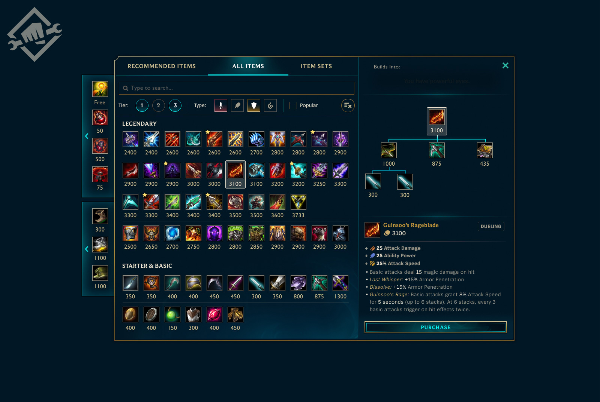

## Góc nhìn 

Góc nhìn từ trên xuống, cảnh và đồ vật được bố trí theo ô vuông  
Sẽ có bảng đơn hàng  

## Đơn hàng

Mỗi đơn hàng sẽ là tổ hợp những vật phẩm (nông sản).  
Và sẽ được làm mới theo ngày  

## Shopping

Qua ngày người chơi sẽ mua vật phẩm xài một lần  
Hoặc là các tiện ích mua rồi xài nhiều lần (như daden chẳng hạn)

## Inventory

Ngoài ra còn có chỗ đễ trữ đồ, người chơi có thể chưa nông sản,  
Có thể nông sản chỉ có thể trữ trong thơi gian ngắn và không quá dài vì sẽ bị hư hỏng
